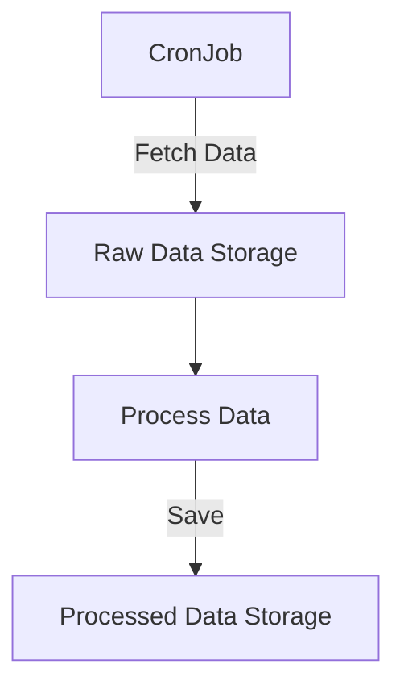
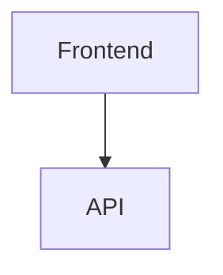
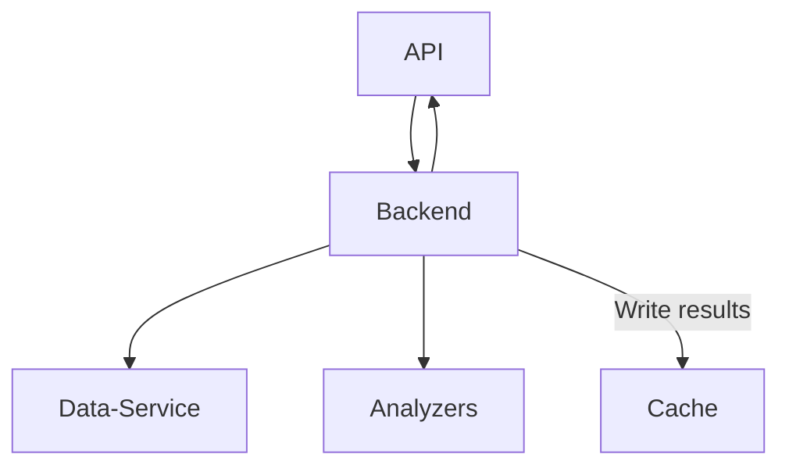

## Architecture

```mermaid
graph TD
    Cronjob[CronJob] -->|Fetch Data| Store[Raw Data Storage]
    Store --> Process[Process Data]
    Process -->|Save| DB[Processed Data Storage]
```

## Frontend

```mermaid
graph TD
    Frontend[Frontend] --> API[API]
```

## API

```mermaid
graph TD
    API --> Backend
    Backend --> Data-Service
    Backend --> Analyzers 
    Backend --> |Write results| Cache
    Backend --> API
```

## Job Server
Keeps track of downloaded stock data and to be download data.